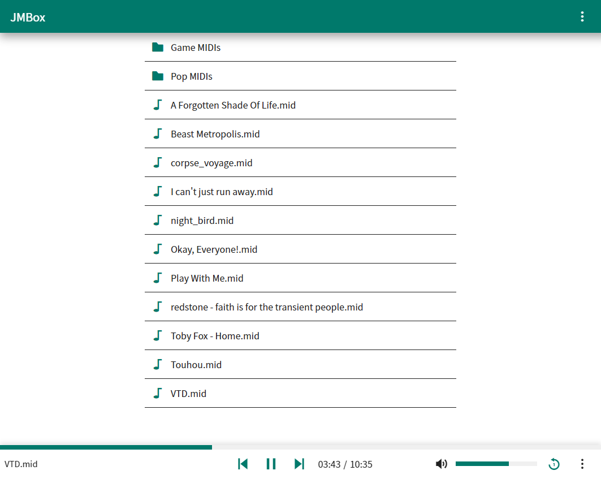

# JMBox
Simple MIDI File Server



JMBox is a lightweight MIDI server software that allows users to convert MIDI files to audio and stream them, and use a browser-based player to play them back. It also features an 8-bit MIDI browser-based player, playback controls, and the ability to directly control MIDI devices, including your software synthesizers, virtual MIDI synthesizers, and physical MIDI devices like pianos.

One of the key advantages of JMBox is its versatility. It can be run on a smartphone using the Termux app, allowing users to share MIDI files with others over a shared hotspot. It can also be run on a NAS device, making it accessible to anyone on the local network.

JMBox even includes a high-performance piano roll feature, allowing users to visualize MIDI data in a more intuitive way. The piano roll is able to open and smoothly render MIDI files with over 1 million notes on a personal computer with ease.

Some limitations of JMBox include the need to fully render audio files before seeking, as well as a significant delay when controlling MIDI devices. Despite this, JMBox offers a convenient and lightweight solution for MIDI playback and control. The developer of JMBox welcomes pull requests to address these limitations and improve the software.

## Server Properties
JMBox will automatically generate a `server.properties` in the current folder on first run.

| property | default | description |
| --- | ------ | ----------- |
| server-name | JMBox | The displayed server name. |
| port | 60752 | The server port. |
| external-ui | | Path to the external UI. |
| streaming-file-size | 786432 | The minimum size to enter the streaming mode. |
| max-file-size | 1048576 | The maximum allowed size for MIDI files in bytes. |
| theme-color | #00796b | The theme color for the UI. |
| enable-midi | true | Whether to enable MIDI API. |
| enable-play | true | Whether to enable WAVE playback API. |
| scan-for-audio | false | Whether to enable the server to scan for audio files. |
| gervill-max-polyphony | 256 | Max polyphony. |
| gervill-interpolation | sinc | Audio interpolation algorithm. |
| gervill-large-mode | false | Use large mode. |

## Building

Building a pure Java software is simple, just follow these steps:
  1. Clone this repository 
  2. Navigate to the project directory
  3. Build the project using Gradle: 
  ```
  ./gradlew jar
  ```
  4. The compiled software will be located in the `build/libs` directory.